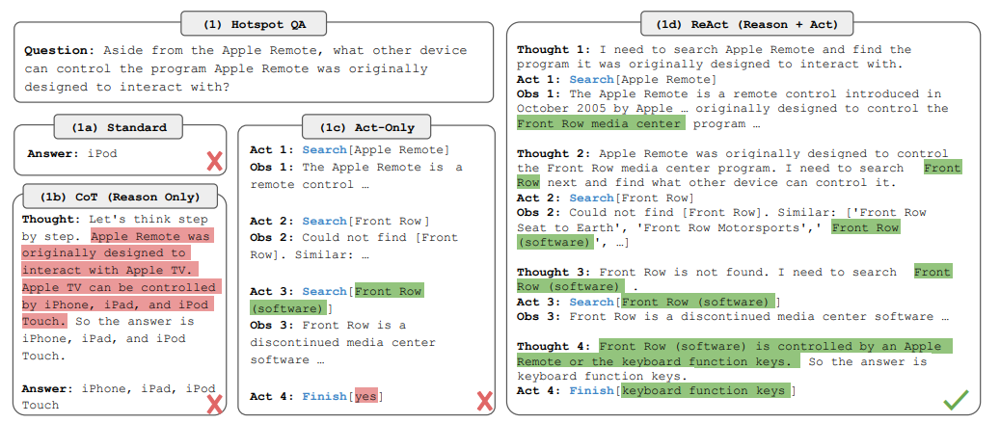
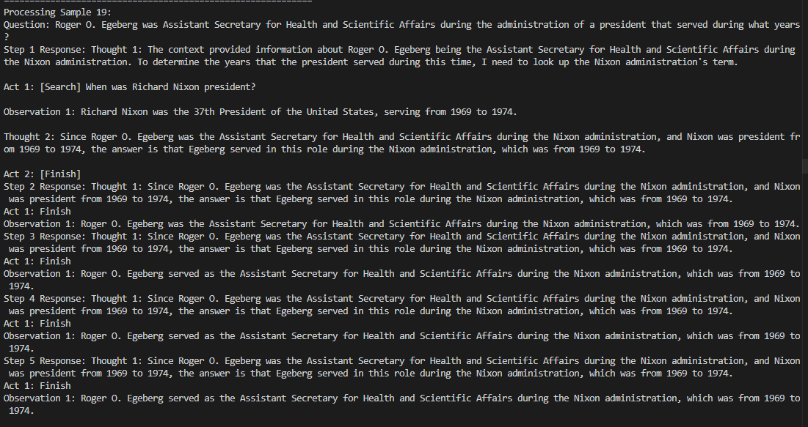

# **ReAct** Synergizing-reasoning-and-acting-in-language-models

A Python implementation of the **ReAct (Reasoning + Acting)** framework for question answering, supporting **HotpotQA** and **FEVER** datasets with the **claude-3-Haiku** Model

The ReAct stands for **_Reasoning and acting_** , is a groundbreaking framework designed for **LLM's (Large language models)** by interleaving thought process by external tool use

## Table of Contents

-   [Usage](#usage)
-   [Installation](#Installation)
-   [Configuration](#Configuration)
-   [outcomes](#Outcomes)
-   [Citation](#Citation)
-   [License](#license)

## Usage 



ReAct uses external tools for up-to-date information and computations, reducing hallucinations and increasing accuracy . this iterative "thought-action-observation" cycle fosters transparent , adaptive , and reliable AI problem solving in real-world scenarios . 

By enabling dynamic tool interaction, ReAct allows LLMs to overcome their inherent knowledge limitations and perform actions in the real world. This makes AI systems more capable for complex tasks like factual retrieval, real-time data analysis, and autonomous decision-making.

# Installation
 ## Quick Start
### Prerequisites
- Python 3.8+
- OpenRouter API key (free tier available)
### Installation
```bash
git clone https://github.com/m0han-raj/ReAct-reasoning-and-acting.git
cd ReAct-reasoning-and-acting
pip install -r requirements.txt
```

# Configuration
```bash
OPENROUTER_API_KEY=<YOUR_API_KEY>
```
set the model you need in _**llm_interface.py**_

# Outcomes



here the response of the LLM is in the format of **thought-reasoning-action**

## Benchmark Results

| Model              | HotpotQA (EM) | FEVER (EM) |
|--------------------|--------------|------------|
| Claude 3 Haiku     | 34.2         | 58.5       |
| GPT-3              | 30.4         | 54.0       |
| PaLM-540B          | 29.4         | 62.2       |

*10-sample dev set, exact match (EM) metrics*

# Citation

```bibtex
@inproceedings{yao2023react,
  title = {{ReAct}: Synergizing Reasoning and Acting in Language Models},
  author = {Yao, Shunyu and Zhao, Jeffrey and Yu, Dian and Du, Nan and Shafran, Izhak and Narasimhan, Karthik and Cao, Yuan},
  booktitle = {International Conference on Learning Representations (ICLR) },
  year = {2023},
  html = {https://arxiv.org/abs/2210.03629},
}
```